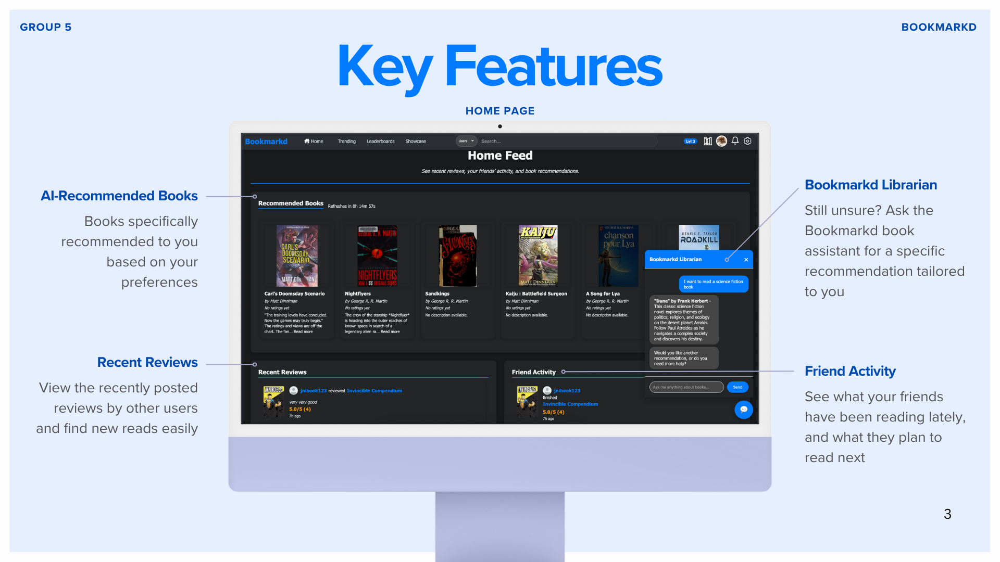
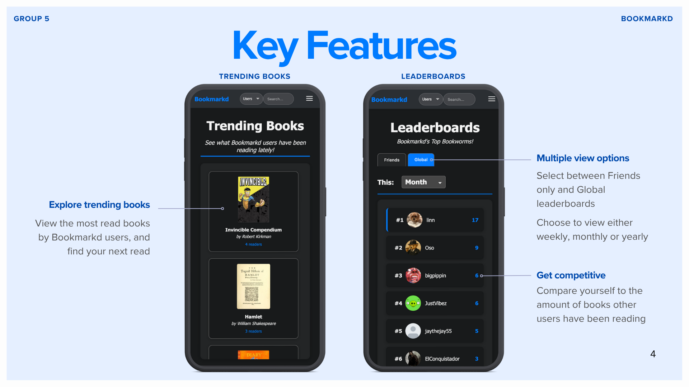
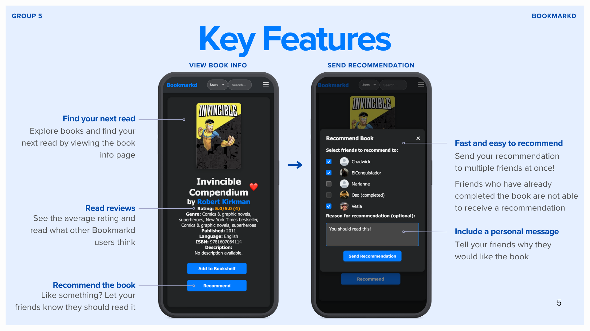
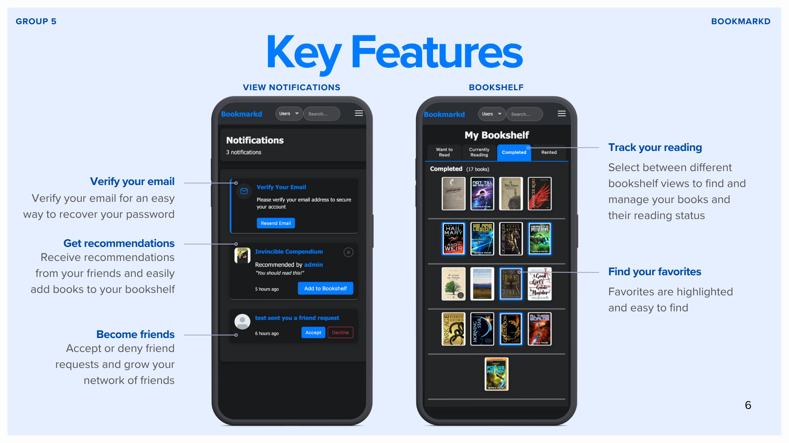
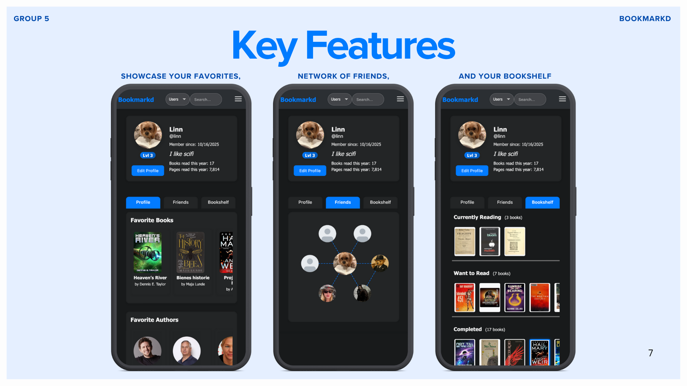

# Bookmarkd SWE Project Fall 2025

## Live demo
The application is available for use [here](https://bookmarkdd.com/)

## Images
<p align="center">
    
    
    
    
    
</p>

## Running it locally

To set up and run the application locally, follow the steps below.
1. Clone the project from the github repository:

    ```bash
    git clone https://github.com/hcortes1/BookmarkdSWEProject.git 
    ```

2. Navigate to the project directory:

    ```bash
    cd BookmarkdSWEProject
    ```

3. Install dependencies
   
    All required python packages are listed in the `requirements.txt` file. Run the following command to install them from inside the project directory:

    ```bash
    pip3 install -r requirements.txt
    ```

5. Environment configuration

    Create a `.env` file in the `backend/` folder and add the following variables:

    ```bash
    # Supabase database credentials
    user=
    password=
    host=
    port=
    dbname=
    SUPABASE_URL=
    SUPABASE_KEY=
    GEMINI_API_KEY=
    EMAIL_USER=
    EMAIL_PASSWORD=
    ```

6. Run the application

    Once dependencies are installed and the environment file is configured launch the application using:

    ```bash
    python3 app.py –-hostname <optional-hostname> –-port <optional-port>
    ```

    If no hostname or port are provided the app will run at the default address: `http://127.0.0.1:8080/`
